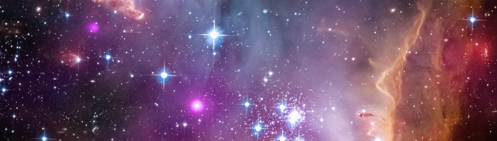

<h1 align="center">hey, i'm david 🌌</h1>

  <strong>engineering leader · ai researcher · author · <em>the space between</em></strong>

  <a href="https://davidbyrondrake.com">🌐 website</a> ·
  <a href="https://iwillnotdrinkwithyoutoday.com">📖 book</a> ·
  <a href="https://linkedin.com/in/randomdrake">💼 linkedin</a> ·
  <a href="https://randomdrake.substack.com">✍️ substack</a> ·
  <a href="https://randomdrake.medium.com">📝 medium</a>

---

I build things at the intersection of human capability and artificial intelligence. Former **Y Combinator CTO** and **startup CEO** turned AI researcher. I spent my early years on stage and behind cameras before finding my way into terminals and codebases — and I think that journey shapes everything I make.

I live in Oregon with my wife and daughter. I wrote a book called [***I Will Not Drink With You Today***](https://iwillnotdrinkwithyoutoday.com/) — 366 Stoic reflections for navigating the quiet work of sobriety. My writing has reached hundreds of thousands of readers and appeared in **Sky News** and **The Huffington Post**.

I believe in good humans, strong coffee, and the outdoors. ☕🌲

---

### 🔭 what i'm up to

- Researching **narrative compression** and the architecture of meaning
- Building at the intersection of **AI and human experience**
- Writing daily on [Substack](https://randomdrake.substack.com) and weekly on [Medium](https://randomdrake.medium.com)
- Available for **speaking** on engineering leadership, storytelling for technologists, and sustainable sobriety
- **Open to opportunities** — [let's talk](mailto:david@randomdrake.com)

### ✨ notable open source

| Project | Description | |
|---|---|---|
| [**nasa-apod-desktop**](https://github.com/randomdrake/nasa-apod-desktop) | Auto-downloads NASA's Astronomy Picture of the Day as your desktop wallpaper | ⭐ 151 |
| [**human-headers**](https://github.com/randomdrake/human-headers) | Lets developers put a little more of themselves into their work | ⭐ 23 |
| [**jenks**](https://github.com/randomdrake/jenks) | PHP implementation of Jenks Natural Breaks Optimization for choropleth mapping | ⭐ 12 |

### 🧰 things i work with

`Python` · `TypeScript` · `React` · `Next.js` · `PHP` · `Shell` · `AI/ML` · `JavaScript` · `HTML/CSS`

### 🌲 a few things about me

- 🎭 Theatre → CS pipeline survivor (yes, really)
- 🔬 Science nerd with a **Commodore 64 tattoo**
- 📺 Equally comfortable on stage, in front of a camera, or deep in a terminal
- ✍️ 18 years of writing about ambition, technology, and modern life
- 🏔️ Oregon, always

---

### 🔗 find me elsewhere

  <a href="https://davidbyrondrake.com">Website</a> ·
  <a href="https://linkedin.com/in/randomdrake">LinkedIn</a> ·
  <a href="https://instagram.com/randomdrake">Instagram</a> ·
  <a href="https://threads.com/@randomdrake">Threads</a> ·
  <a href="https://tiktok.com/@randomdrake42">TikTok</a> ·
  <a href="https://github.com/randomdrake">GitHub</a> ·
  <a href="mailto:david@randomdrake.com">Email</a>

---

Banner: <a href="https://unsplash.com/@nasahubble">NASA Hubble Space Telescope</a> via <a href="https://unsplash.com/photos/photo-1709141426613-27e8b5d55f13">Unsplash</a> · Open to work 📫
