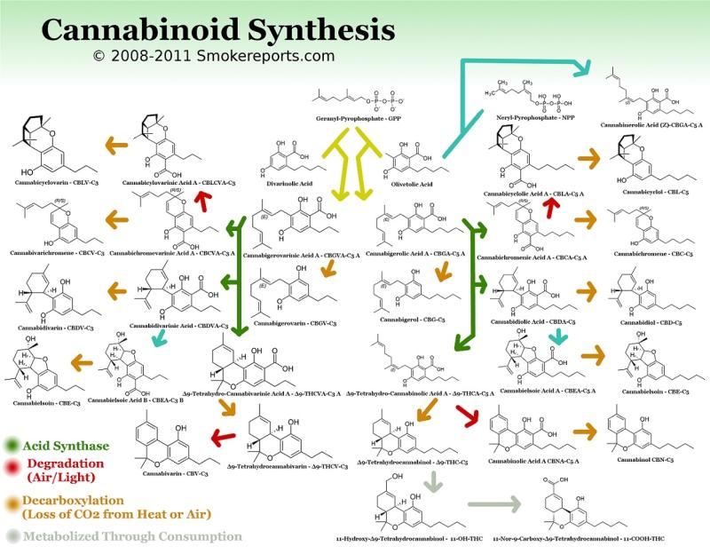

<h1 align="center">David Drake</h1>

  <strong>engineering leader · ai researcher · author · <em>the space between</em></strong>

  Engineering, sobriety, fatherhood, and the space between.

  <a href="https://davidbyrondrake.com">🌐 Website</a> ·
  <a href="https://randomdrake.substack.com">✍️ Substack</a> ·
  <a href="https://iwillnotdrinkwithyoutoday.com">📖 Book</a> ·
  <a href="https://linkedin.com/in/randomdrake">💼 LinkedIn</a> ·
  <a href="https://randomdrake.medium.com">📝 Medium</a> ·
  <a href="mailto:david@randomdrake.com">📫 Email</a>

---

### ✍️ Daily Writing

I write every single day. Engineering, sobriety, fatherhood, and the space between. Subscribe to get new posts delivered straight to your inbox.

  

---

I build things at the intersection of human capability and artificial intelligence. Former **Y Combinator CTO** and **startup CEO** turned AI researcher. I was the first to **chart the complete phytocannabinoid synthesis process**. I spent my early years on stage and behind cameras before finding my way into terminals and codebases — and I think that journey shapes everything I make.

I live in Oregon with my wife and daughter. I wrote a book called [***I Will Not Drink With You Today***](https://iwillnotdrinkwithyoutoday.com/) — 366 Stoic reflections for navigating the quiet work of sobriety. My writing has reached hundreds of thousands of readers and appeared in **Sky News** and **The Huffington Post**.

---

### 📚 Repositories

| Project | Description | |
|---|---|---|
| [**nasa-apod-desktop**](https://github.com/randomdrake/nasa-apod-desktop) | Auto-downloads NASA's Astronomy Picture of the Day as your desktop wallpaper | ⭐ 151 |
| [**human-headers**](https://github.com/randomdrake/human-headers) | Lets developers put a little more of themselves into their work | ⭐ 23 |
| [**jenks**](https://github.com/randomdrake/jenks) | PHP implementation of Jenks Natural Breaks Optimization for choropleth mapping | ⭐ 12 |

### 💻 Language Breakdown

`Python` · `TypeScript` · `React` · `Next.js` · `PHP` · `Shell` · `AI/ML` · `JavaScript` · `HTML/CSS`

### 🤖 Claude AI Usage

I build with Claude daily — Opus is my primary model. AI isn't just a tool I use; it's a space I research, write about, and build in.

### 🧬 Phytocannabinoid Synthesis

I was the first to chart the complete phytocannabinoid synthesis process — mapping every pathway from precursor molecules through acid synthase, degradation, decarboxylation, and metabolization.

  

### ⚡ About

- 🎭 Theatre → CS pipeline survivor (yes, really)
- 🧬 First to chart the complete **phytocannabinoid synthesis process**
- 🔬 Science nerd with a **Commodore 64 tattoo**
- 📺 Equally comfortable on stage, in front of a camera, or deep in a terminal
- ✍️ 18 years of writing about ambition, technology, and modern life
- 🏔️ Oregon, always

---

### 🔗 Find Me Elsewhere

  <a href="https://davidbyrondrake.com">Website</a> ·
  <a href="https://linkedin.com/in/randomdrake">LinkedIn</a> ·
  <a href="https://instagram.com/randomdrake">Instagram</a> ·
  <a href="https://threads.com/@randomdrake">Threads</a> ·
  <a href="https://tiktok.com/@randomdrake42">TikTok</a> ·
  <a href="https://github.com/randomdrake">GitHub</a> ·
  <a href="mailto:david@randomdrake.com">Email</a>

---

  <code>SOC 2</code> · <code>HIPAA</code> · <code>ISO 42001</code>

  Built with 💜 and too much coffee ☕

Banner: <a href="https://unsplash.com/@nasahubble">NASA Hubble Space Telescope</a> via <a href="https://unsplash.com/photos/photo-1709141426613-27e8b5d55f13">Unsplash</a>
