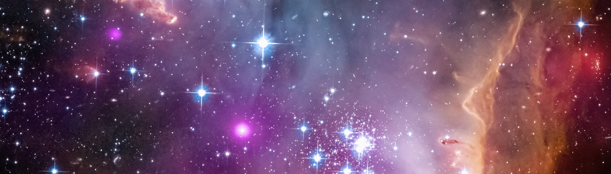

<h1 align="center">David Byron Drake</h1>

  <strong>Engineering Leader · AI-Forward Engineer · Published Author</strong>

  Silicon Valley veteran. Former CEO / CTO. 
  I help leaders and organizations navigate AI with clarity, honesty, and a focus on lasting autonomy.

  <a href="https://davidbyrondrake.com">Website</a> ·
  <a href="https://linkedin.com/in/randomdrake">LinkedIn</a> ·
  <a href="https://randomdrake.medium.com">Medium</a> ·
  <a href="https://iwillnotdrinkwithyoutoday.com">Book</a> ·
  <a href="mailto:david@randomdrake.com">Email</a>

---

## About

I am an engineering leader with 18+ years of software development experience, building and scaling teams at the intersection of human capability and artificial intelligence. My work focuses on practical AI implementation, high-trust team building, and the engineering culture that lets both succeed.

Earlier in my career, I served as CEO and CTO of venture-backed companies, including a Y Combinator–backed startup. My writing has reached hundreds of thousands of readers and has appeared in *Sky News* and *The Huffington Post*.

I live in Oregon with my wife and daughter.

---

## Focus Areas

- **Leadership** — Engineering management, team building, and product strategy
- **Technical** — AI/LLMs, Python, TypeScript, Go, React, cloud infrastructure
- **Strategic** — AI implementation, SaaS development, startup operations

---

## Selected Work

### Book — *I Will Not Drink With You Today*

[*I Will Not Drink With You Today*](https://iwillnotdrinkwithyoutoday.com/) is a daily companion for sobriety: 366 Stoic reflections on stillness, presence, and the quiet work of staying sober.

### GitHub Dashboard

A live engineering dashboard with real-time analytics, language breakdown, pipeline status, and Claude API integration metrics.

  <a href="https://randomdrake.github.io"><strong>View the live dashboard →</strong></a>

---

## Writing

I write on engineering leadership, AI, sobriety, and the discipline of building well. Recent essays are published on [Medium](https://randomdrake.medium.com).

---

## Speaking & Advisory Topics

- High-trust team building
- AI implementation and engineering strategy
- Engineering storytelling and communication
- Sobriety and sustainable leadership
- Creative practice for technologists

---

## Contact

Currently open to opportunities in engineering leadership and AI strategy.

  <a href="https://davidbyrondrake.com">davidbyrondrake.com</a> ·
  <a href="https://linkedin.com/in/randomdrake">LinkedIn</a> ·
  <a href="mailto:david@randomdrake.com">david@randomdrake.com</a>

Banner: <a href="https://unsplash.com/@nasahubble">NASA Hubble Space Telescope</a> via <a href="https://unsplash.com/photos/photo-1709141426613-27e8b5d55f13">Unsplash</a>
